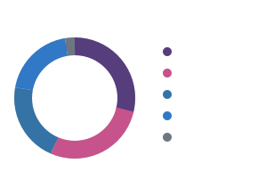

- [My Computer Vision Notes](https://owenarink.github.io/computervision101uva/) - University of Amsterdam computer vision notes and lecture summaries

- [kaggle_commonsense](https://github.com/owenarink/kaggle_commonsense) - commonsense reasoning experiments for false-sentence repair

-> [DeBertaCommonSense](https://github.com/owenarink/DeBertaCommonSense), [🤗](https://huggingface.co/owenarink/attentiontypes-commonsense) - final model in the commonsense reasoning experiments

- [repstruc](https://github.com/owenarink/repstruc) - tool for keeping repository README structure blocks in sync
- [prolog-to-arduino-lcd](https://github.com/owenarink/prolog-to-arduino-lcd) - Prolog-controlled Arduino LCD and logic programming project

  

